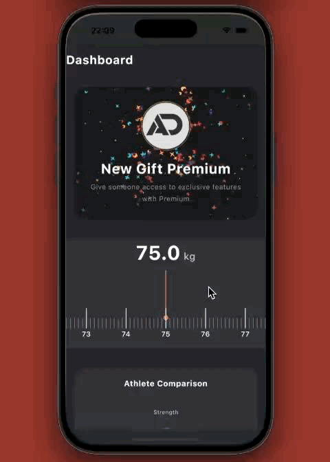
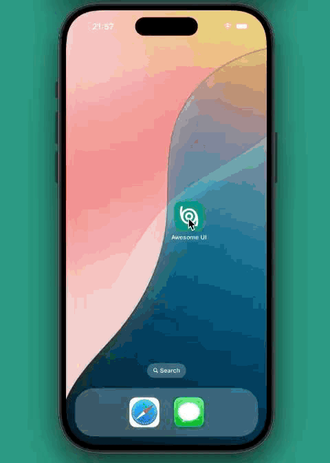
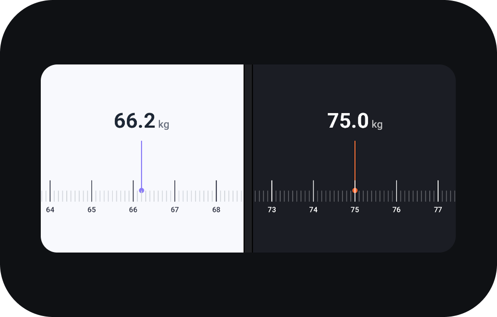
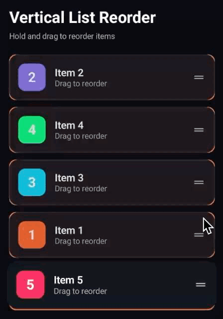
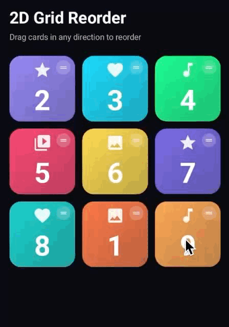
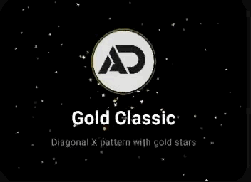
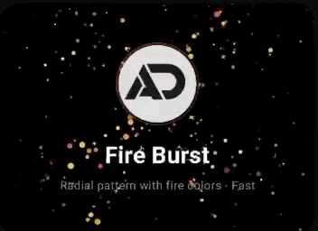
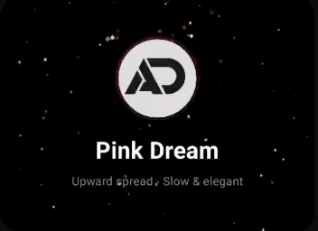
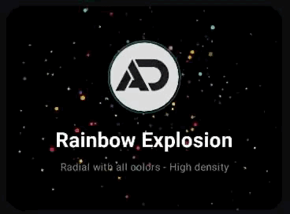
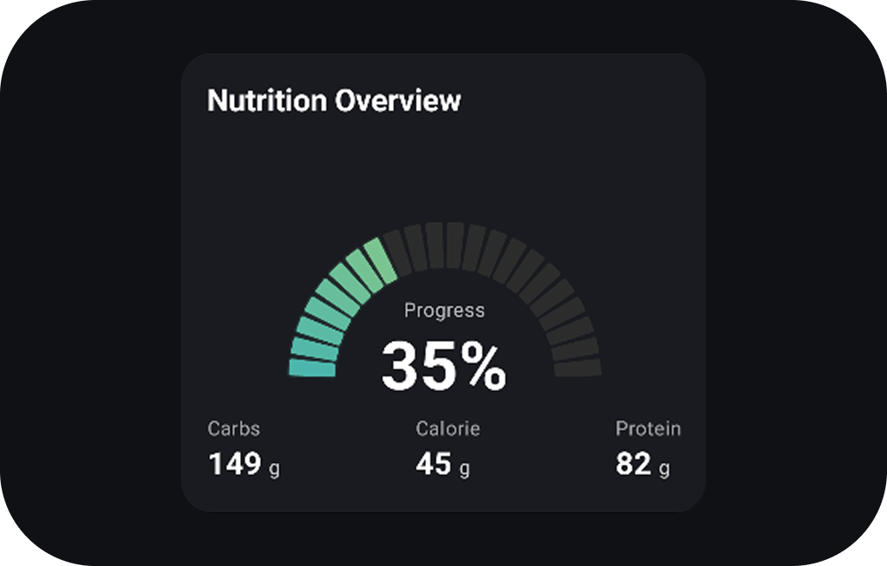

# AwesomeUI

  

A collection of **"copy, paste, use"** snippets and useful elements for those who intend to or are already developing an app in **Compose Multiplatform** or simply an Android app and already use **Jetpack Compose** and **Material3**.

## Showcase

---

## 🧩 Components
<table>
<tr>
<td><br/></td>
<td><br/></td>
</tr>
</table>

### 📈 ProgressionChart

A line chart with smooth curves, gradient fill, glow effects, and trend indicator badge.

<table>
<tr>
<td><br/><b>ProgressionChart</b></td>
<td><br/><b>DoubleTouch</b></td>
</tr>
</table>

```kotlin
ProgressionChartGlow(
    data = listOf(
        ChartDataPoint(100f, "Nov 1"),
        ChartDataPoint(90f, "Nov 15"),
        ChartDataPoint(100f, "Dec 1"),
        ChartDataPoint(103f, "Dec 15"),
        ChartDataPoint(105f, "Today"),
    ),
    title = "Bench Press 1RM",
    value = "105 kg",
    trend = "+5%",
    trendDirection = TrendDirection.UP,
    style = ProgressionChartStyle(
        lineColor = ProgressionGlowColors.LineGreen
    )
)
```
```kotlin
// See FullAnalyticsPreview()
ProgressionChartGlow(
    data = analyticsData,
    style = ProgressionChartStyle(lineColor = ProgressionGlowColors.LinePurple, chartHeight = 220.dp, glowAlpha = 0.5f, lineWidth = 4.dp),
    initialSelectionRange = 0.45f..0.82f,
    animate = false,
    onRangeSelection = { currentRange = it },
)
```

**Key Parameters:**
| Parameter | Description |
|-----------|-------------|
| `data` | List of `ChartDataPoint(value, label)` |
| `title` | Chart title (e.g., exercise name) |
| `value` | Main value display |
| `trend` | Trend percentage (e.g., "+5%") |
| `trendDirection` | `TrendDirection.UP`, `DOWN`, or `NEUTRAL` |
| `style` | Customize line color, glow, grid, gradients |

**Features:**
- Smooth cubic Bézier curves
- Gradient fill under the line
- Glow effect on the line
- Last point highlighted with glow ring
- Trend badge with icon

---

### 🔥 DeformableCornerItem

A customizable card with deformable corners and a circular cutout for icons.


```kotlin
DeformableCornerItem(
    modifier = Modifier.size(200.dp),
    circleRadius = 24.dp,
    cardColor = Color(0xFFE0E0E0),
    circleColor = Color(0xFFFF5252),
    topLeft = 32.dp,
    bottomLeft = 32.dp,
    bottomRight = 32.dp,
    contentCircle = {
        Icon(
            imageVector = Icons.Default.LocalFireDepartment,
            contentDescription = null,
            tint = Color.White,
            modifier = Modifier.align(Alignment.Center)
        )
    },
    contentRectangle = {
        Text("Your content here", modifier = Modifier.align(Alignment.Center))
    }
)
```

**Key Parameters:**
| Parameter | Description |
|-----------|-------------|
| `circleRadius` | Radius of the corner circle |
| `cardColor` | Background color of the card |
| `topLeft`, `bottomLeft`, `bottomRight` | Corner radius for each corner |
| `contentCircle` | Composable content inside the circle |
| `contentRectangle` | Composable content inside the card |

---

### ⏱️ TimerWatch

A circular countdown timer with animated progress arc, glow effect, and heartbeat animation.


```kotlin
TimerWatch(
    timerState = TimerState(
        timeRemaining = 45,
        totalTime = 60,
        isRest = false
    ),
    isOvertime = false,
    showHeartbeat = true,
    style = CircularTimerDefaults.style()
)
```

**Key Parameters:**
| Parameter | Description |
|-----------|-------------|
| `timerState` | Contains `timeRemaining`, `totalTime`, `isRest` |
| `isOvertime` | Shows red overtime state when true |
| `showHeartbeat` | Enables pulsing animation under 5 seconds |
| `style` | Customize colors, sizes, typography |

**States:**
- **Work** → Green progress
- **Rest** → Amber progress
- **Overtime** → Red progress with negative time display
- **Heartbeat** → Pulsing animation when < 5 seconds

---

### 📊 BasicBarChart

A weekly bar chart with striped inactive bars and solid active bar.


```kotlin
val weekData = listOf(
    BarData(label = "Mon", progress = 0.7f),
    BarData(label = "Tue", progress = 0.4f),
    BarData(label = "Wed", progress = 0.6f),
    BarData(label = "Thu", progress = 0f),
    BarData(label = "Fri", progress = 0.5f),
    BarData(label = "Sat", progress = 1.0f),
    BarData(label = "Sun", progress = 0.65f),
)

BasicBarChart(
    chartData = weekData,
    selectedIndex = 2,
    activeBarColor = Color(0xFFF48C46),
    onBarClick = { index -> /* handle click */ }
)
```

**Key Parameters:**
| Parameter | Description |
|-----------|-------------|
| `chartData` | List of `BarData(label, progress)` |
| `selectedIndex` | Index of highlighted bar (-1 for none) |
| `activeBarColor` | Color of the selected bar |
| `onBarClick` | Callback when a bar is clicked |

---

### 🎯 TrackerContainer

A segmented progress tracker with animated fill, glow effects, and completion checkmark.


```kotlin
TrackerContainer(
    fillPercentage = 0.5f,  // 0.0 to 1.0
    isCompleted = false,
    isActive = true,
    isGlobalComplete = false,
    waveDelayMillis = 0,
    rangeStart = 0,
    rangeEnd = 100,
    style = GlowingTrackerDefaults.style()
)
```

**Key Parameters:**
| Parameter | Description |
|-----------|-------------|
| `fillPercentage` | Progress from 0.0 to 1.0 |
| `isCompleted` | Shows checkmark when true |
| `isActive` | Highlights the segment |
| `isGlobalComplete` | Triggers wave animation |
| `style` | Customize colors, block size, animations |

```kotlin
MuscleGroupDonutVariant(
    segments = listOf(
        DonutSegment("Chest", 5000f, 0.32f, DonutVariantColors.Purple, "5k kg"),
        DonutSegment("Legs", 4500f, 0.28f, DonutVariantColors.Orange, "4.5k kg"),
        DonutSegment("Back", 4000f, 0.25f, DonutVariantColors.Teal, "4k kg"),
        DonutSegment("Shoulders", 1500f, 0.10f, DonutVariantColors.Yellow, "1.5k kg"),
        DonutSegment("Arms", 800f, 0.05f, DonutVariantColors.Blue, "0.8k kg"),
    ),
    centerContent = {
        Column(horizontalAlignment = Alignment.CenterHorizontally) {
            Text(
                "15.8k",
                fontSize = 24.sp,
                fontWeight = FontWeight.Bold,
                color = Color.White,
            )
            Text(
                "Total kg",
                fontSize = 12.sp,
                color = Color.Gray,
            )
        }
    },
)
```

**Key Parameters:**
| Parameter | Description |
|-----------|-------------|
| `segments` | listOf DonutSegment(label, value, percentage, color, subtitle) |
| `centerContent` | Composable content in the center |

---

### 📅 ConsistencyHeatmapCard

A calendar-based heatmap showing workout consistency with streak tracking and intensity visualization.


```kotlin
ConsistencyHeatmapCardGlow(
    year = 2026,
    month = 1,
    data = HeatmapData(
        dayIntensities = mapOf(
            LocalDate(2026, 1, 5) to 1f,
            LocalDate(2026, 1, 7) to 0.7f,
            LocalDate(2026, 1, 9) to 1f,
        ),
        currentStreak = 2,
        recordStreak = 12,
    ),
    today = LocalDate(2026, 1, 16),
    style = HeatmapStyle(
        accentColor = HeatmapGlowColors.AccentBlue
    ),
    onMonthChange = { newYear, newMonth -> /* handle navigation */ }
)
```

**Key Parameters:**
| Parameter | Description |
|-----------|-------------|
| `year` | Year to display (e.g., 2026) |
| `month` | Month to display (1-12) |
| `data` | `HeatmapData` with `dayIntensities`, `currentStreak`, `recordStreak` |
| `today` | Current date for highlighting |
| `style` | Customize colors, glow, cell styling |
| `onMonthChange` | Callback for month navigation |

**Intensity Levels:**
- **0.0** → Rest day (dark cell)
- **0.3-0.5** → Light workout
- **0.6-0.8** → Moderate workout
- **1.0** → Intense workout (with glow effect)

---

### 🎯 RadarChart
A radar/spider chart with multiple overlapping data series, glow effects, and interactive point selection.


```kotlin
RadarChart(
    axisLabels = listOf(
        RadarAxisLabel("Chest"),
        RadarAxisLabel("Back"),
        RadarAxisLabel("Legs", isHighlighted = true),
        RadarAxisLabel("Shoulders"),
        RadarAxisLabel("Arms"),
    ),
    series = listOf(
        RadarSeries(
            name = "Current",
            values = listOf(0.85f, 0.70f, 0.60f, 0.65f, 0.80f),
            color = RadarColors.DataPrimary,
        ),
        RadarSeries(
            name = "Previous",
            values = listOf(0.65f, 0.55f, 0.75f, 0.45f, 0.60f),
            color = RadarColors.DataWarning,
            fillAlpha = 0.15f,
        ),
    ),
    title = "Progress Comparison",
    onPointClick = { point ->
        // Handle point tap
        println("${point?.seriesName}: ${point?.label} = ${point?.value}")
    }
)
```

**Key Parameters:**
| Parameter | Description |
|-----------|-------------|
| `axisLabels` | List of `RadarAxisLabel(label, isHighlighted)` |
| `series` | List of `RadarSeries(name, values, color, fillAlpha)` |
| `title` | Optional chart title |
| `style` | Customize colors, sizes, glow, grid levels |
| `onPointClick` | Callback when a point is tapped |

**Features:**
- Multiple overlapping series for comparison
- Interactive point selection with tooltip
- Series highlighting on tap (others dim)
- Glow effects on polygon and points
- Gradient fill with customizable alpha
- Backwards compatible single-series API

---

### ⚖️ WeightScalePicker

A horizontal scrollable weight picker with snap-to-tick behavior and haptic feedback.



```kotlin
var weight by remember { mutableFloatStateOf(70f) }

WeightScalePicker(
    value = weight,
    onValueChange = { weight = it },
    minValue = 40f,
    maxValue = 150f,
    step = 0.1f,
    onHapticFeedback = { /* vibrate */ },
    style = WeightScaleStyle(
        accentColor = WeightScaleColors.AccentPurple
    )
)
```

**Key Parameters:**
| Parameter | Description |
|-----------|-------------|
| `value` | Current weight value (e.g., 70.5f) |
| `onValueChange` | Callback when value changes |
| `minValue` | Minimum selectable weight |
| `maxValue` | Maximum selectable weight |
| `step` | Increment between ticks (0.1 = 100g) |
| `onHapticFeedback` | Callback for haptic feedback on tick crossing |
| `style` | Customize colors, tick sizes, indicator |

**Features:**
- Smooth horizontal drag scrolling
- Snap to nearest tick on release
- Major ticks every 1 kg with labels
- Minor ticks every 0.1 kg
- Center indicator line with dot
- Haptic feedback callback
- Light and dark theme support

---

### 🔀 DraggableList & DraggableGrid

Reorderable lists and grids with drag and drop functionality. Supports vertical, horizontal, and 2D grid layouts.



**DraggableList** - 1D reordering (vertical or horizontal):
```kotlin
var items by remember { mutableStateOf(listOf("A", "B", "C", "D")) }

DraggableList(
    items = items,
    onReorder = { newList -> items = newList },
    key = { it },  // IMPORTANT: stable key for correct reordering
    orientation = DragOrientation.VERTICAL,
    style = DraggableListStyle(
        itemSpacing = 12.dp,
        draggedItemScale = 1.02f,
        draggedItemElevation = 8.dp,
    ),
) { item, index, isDragging, dragModifier ->
    Card(
        modifier = Modifier
            .fillMaxWidth()
            .then(dragModifier),  // Apply dragModifier to enable dragging
    ) {
        Text(item)
    }
}
```



**DraggableGrid** - 2D reordering in a grid:
```kotlin
var items by remember { mutableStateOf((1..9).toList()) }

DraggableGrid(
    items = items,
    onReorder = { newList -> items = newList },
    columns = 3,
    key = { it },  // IMPORTANT: stable key for correct reordering
    style = DraggableGridStyle(
        itemSpacing = 12.dp,
        draggedItemScale = 1.08f,
        draggedItemElevation = 16.dp,
    ),
) { item, index, isDragging, dragModifier ->
    Card(
        modifier = Modifier
            .aspectRatio(1f)
            .then(dragModifier),
    ) {
        Text("$item", modifier = Modifier.align(Alignment.Center))
    }
}
```

**Key Parameters:**
| Parameter | Description |
|-----------|-------------|
| `items` | List of items to display |
| `onReorder` | Callback with new list order after drag ends |
| `key` | **CRITICAL**: Function to extract stable unique key from item |
| `orientation` | `VERTICAL` or `HORIZONTAL` (DraggableList only) |
| `columns` | Number of grid columns (DraggableGrid only) |
| `style` | Customize spacing, scale, elevation, colors |
| `itemContent` | Composable for each item (receives `dragModifier`) |

**Features:**
- Long-press to initiate drag
- Animated item shifting during drag
- Floating copy effect with scale and elevation
- Placeholder slots showing drop positions
- Works with LazyColumn/LazyRow/LazyVerticalGrid
- Stable key support for correct recomposition

> ⚠️ **Important**: Always provide a `key` function that returns a stable, unique identifier for each item. Using `hashCode()` or mutable properties will cause incorrect behavior after reordering.

---

### ✨ Premium Particle Effects

A collection of particle effects for creating stunning premium-style animations. Inspired by Telegram Premium gift screens.

<table>
<tr>
<td><br/><b>Gold Classic</b></td>
<td><br/><b>Fire Burst</b></td>
<td><br/><b>Pink Dream</b></td>
<td><br/><b>Rainbow Explosion</b></td>
</tr>
</table>

**PremiumStarCard** - Complete card with particle effects:
```kotlin
PremiumStarCard(
    modifier = Modifier.fillMaxWidth().height(300.dp),
    title = "Gift Premium",
    subtitle = "Give someone access to exclusive features",
    style = PremiumStarCardStyle(
        accentColor = ParticleColors.Gold,
    ),
    burstStyle = ParticleBurstStyle(
        particleCount = 100,
        shapes = listOf(ParticleShape.Star4Point, ParticleShape.Star6Point),
        colors = ParticleColors.GoldPalette,
        emissionPattern = EmissionPattern.DIAGONAL_X,
        cycleDurationMs = 3000,
        spreadAngle = 0.6f,
        flutterEnabled = true,  // Particles oscillate sideways
        maxFlutterAmount = 25f,
    ),
    flickerStyle = FlickerStarsStyle(
        particleCount = 30,
        colors = ParticleColors.GoldPalette,
    ),
    effectCenterOffset = Offset(0f, -60f),  // Move effects behind profile
    profileContent = {
        Image(
            painter = painterResource(Res.drawable.profile),
            contentDescription = "Profile",
            modifier = Modifier.fillMaxSize().clip(CircleShape),
            contentScale = ContentScale.Crop,
        )
    },
)
```

**ParticleBurst** - Standalone particle burst effect:
```kotlin
ParticleBurst(
    style = ParticleBurstStyle(
        particleCount = 80,
        shapes = listOf(ParticleShape.Star4Point, ParticleShape.Circle),
        colors = ParticleColors.FirePalette,
        emissionPattern = EmissionPattern.RADIAL,  // 360° radial pattern
        cycleDurationMs = 2000,  // Faster = more intense
        flutterEnabled = true,
    ),
    centerOffset = Offset(0f, -50f),  // Custom center point
)
```

**Key Parameters:**
| Parameter | Description |
|-----------|-------------|
| `particleCount` | Number of particles (30-200 recommended) |
| `shapes` | List of `ParticleShape`: `Star4Point`, `Star6Point`, `Circle`, `Icon(ImageVector)`, `Drawable(DrawableResource)` |
| `colors` | Color palette: `GoldPalette`, `FirePalette`, `PinkPalette`, `RainbowPalette` |
| `emissionPattern` | `DIAGONAL_X`, `RADIAL`, `UPWARD`, `UPWARD_SPREAD`, `DOWNWARD`, `HORIZONTAL` |
| `cycleDurationMs` | Animation duration (lower = faster) |
| `spreadAngle` | Cone width in radians (0.4-1.2) |
| `flutterEnabled` | Enables sideways oscillation |
| `maxFlutterAmount` | Oscillation amplitude in pixels |
| `effectCenterOffset` | `Offset(x, y)` to move effect origin |

**Available Effects:**
- **ParticleBurst** → Stars/shapes shooting from center
- **EmberEffect** → Fire-like sparks rising upward
- **FlickerStarsEffect** → Stars with random intermittent visibility
- **StarfieldBackground** → Static twinkling star background
- **PremiumParticleEffect** → Combined effect (all above)
- **PremiumStarCard** → Complete card with profile, title, and effects

---

### 🎯 NutritionCard (Semi-Circle Gauge)

A nutrition tracking card with a semicircular segmented gauge, gradient progression, and stats footer.



```kotlin
NutritionCard(
    title = "Nutrition Overview",
    score = 70,  // 0 to 100
    scoreLabel = "Progress",
    stats = listOf(
        NutritionStat("Carbs", "149", "g"),
        NutritionStat("Calories", "1850", "kcal"),
        NutritionStat("Protein", "82", "g")
    ),
    accentGradient = listOf(Color(0xFF4DB6AC), Color(0xFFD4E157)),
    backgroundColor = Color(0xFF121212),
    contentColor = Color.White,
    actionIcon = Icons.Default.MoreVert  // Optional action icon
)
```

**Key Parameters:**
| Parameter | Description |
|-----------|-------------|
| `title` | Card title (e.g., "Nutrition Overview") |
| `score` | Progress value from 0 to 100 |
| `scoreLabel` | Label above the percentage (e.g., "Progress", "Daily Goal") |
| `stats` | List of `NutritionStat(label, value, unit)` for footer |
| `accentGradient` | Color gradient for filled segments |
| `backgroundColor` | Card background color |
| `actionIcon` | Optional icon in top-right corner |

**Standalone Gauge Component:**
```kotlin
NutritionGauge(
    progress = 0.7f,  // 0.0 to 1.0
    gradient = listOf(Color(0xFF4DB6AC), Color(0xFFD4E157)),
    modifier = Modifier.size(280.dp),
    segments = 22,  // Number of arc segments
    innerRadiusDp = 80.dp,
    outerRadiusDp = 110.dp,
    cornerRadius = 8f,  // Roundness of segment corners
    showGlow = true,
    glowAlpha = 0.1f
)
```

**Features:**
- Semi-circular segmented arc (180°)
- Smooth gradient across filled segments
- Rounded segment corners with glow effect
- Inactive segments shown in dark gray
- Large centered percentage display
- Footer with up to 3 stats
- Fully customizable colors and dimensions

---

## 📁 Project Structure

```
sharedUI/src/commonMain/kotlin/com/arcadone/awesomeui/components/
WIP
```

---

## 🚀 Getting Started

1. Copy the component file(s) you need into your project
2. Adjust the package declaration
3. Import required dependencies (Material3, Compose Foundation)
4. Use the components as shown in the snippets above

---
# ⭐ Star History

<a href="https://star-history.com/#ArcaDone/AwesomeUI&Date">
 <picture>
   <source media="(prefers-color-scheme: dark)" srcset="https://api.star-history.com/svg?repos=ArcaDone/AwesomeUI&type=Date&theme=dark" />
   <source media="(prefers-color-scheme: light)" srcset="https://api.star-history.com/svg?repos=ArcaDone/AwesomeUI&type=Date" />
   
 </picture>
</a>

## 📄 License

This project is open source. See [LICENSE](LICENSE) for details.
