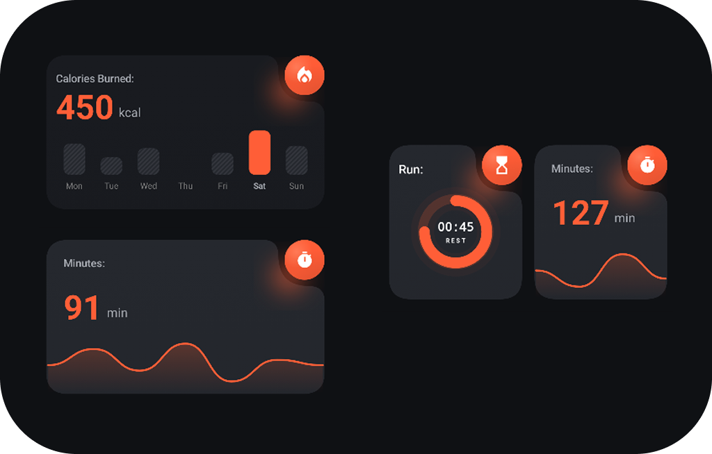
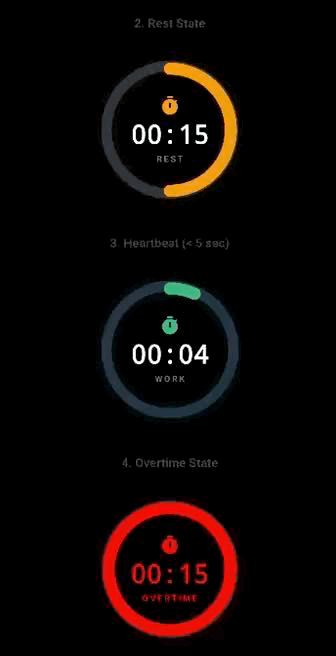
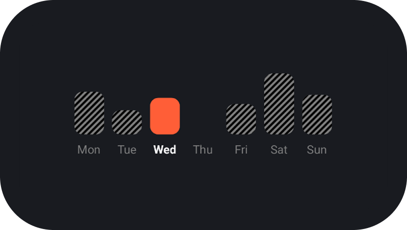
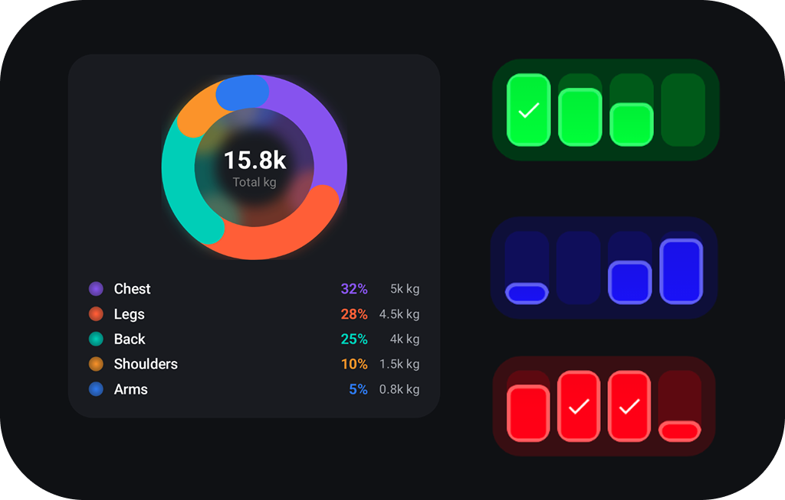
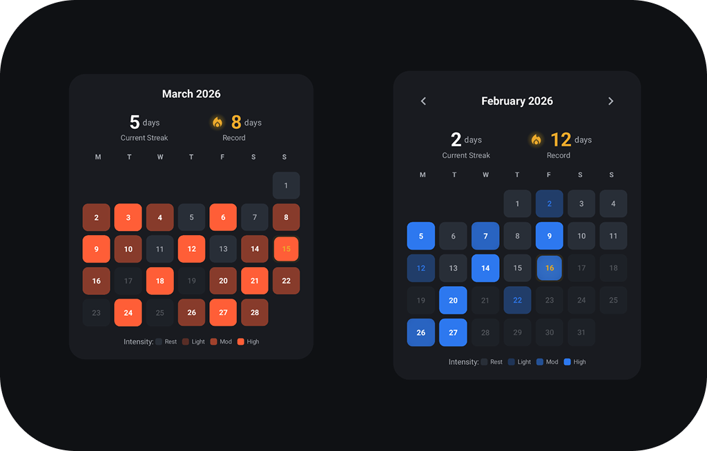
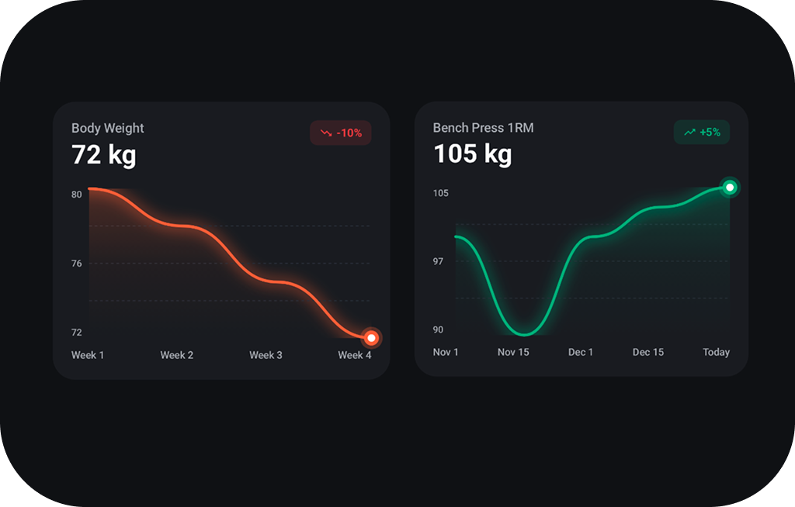

# AwesomeUI

A collection of **"copy, paste, use"** snippets and useful elements for those who intend to or are already developing an app in **Compose Multiplatform** or simply an Android app and already use **Jetpack Compose** and **Material3**.

---

## 🧩 Components

### 🔥 DeformableCornerItem

A customizable card with deformable corners and a circular cutout for icons.



```kotlin
DeformableCornerItem(
    modifier = Modifier.size(200.dp),
    circleRadius = 24.dp,
    cardColor = Color(0xFFE0E0E0),
    circleColor = Color(0xFFFF5252),
    topLeft = 32.dp,
    bottomLeft = 32.dp,
    bottomRight = 32.dp,
    contentCircle = {
        Icon(
            imageVector = Icons.Default.LocalFireDepartment,
            contentDescription = null,
            tint = Color.White,
            modifier = Modifier.align(Alignment.Center)
        )
    },
    contentRectangle = {
        Text("Your content here", modifier = Modifier.align(Alignment.Center))
    }
)
```

**Key Parameters:**
| Parameter | Description |
|-----------|-------------|
| `circleRadius` | Radius of the corner circle |
| `cardColor` | Background color of the card |
| `topLeft`, `bottomLeft`, `bottomRight` | Corner radius for each corner |
| `contentCircle` | Composable content inside the circle |
| `contentRectangle` | Composable content inside the card |

---

### ⏱️ TimerWatch

A circular countdown timer with animated progress arc, glow effect, and heartbeat animation.



```kotlin
TimerWatch(
    timerState = TimerState(
        timeRemaining = 45,
        totalTime = 60,
        isRest = false
    ),
    isOvertime = false,
    showHeartbeat = true,
    style = CircularTimerDefaults.style()
)
```

**Key Parameters:**
| Parameter | Description |
|-----------|-------------|
| `timerState` | Contains `timeRemaining`, `totalTime`, `isRest` |
| `isOvertime` | Shows red overtime state when true |
| `showHeartbeat` | Enables pulsing animation under 5 seconds |
| `style` | Customize colors, sizes, typography |

**States:**
- **Work** → Green progress
- **Rest** → Amber progress
- **Overtime** → Red progress with negative time display
- **Heartbeat** → Pulsing animation when < 5 seconds

---

### 📊 BasicBarChart

A weekly bar chart with striped inactive bars and solid active bar.



```kotlin
val weekData = listOf(
    BarData(label = "Mon", progress = 0.7f),
    BarData(label = "Tue", progress = 0.4f),
    BarData(label = "Wed", progress = 0.6f),
    BarData(label = "Thu", progress = 0f),
    BarData(label = "Fri", progress = 0.5f),
    BarData(label = "Sat", progress = 1.0f),
    BarData(label = "Sun", progress = 0.65f),
)

BasicBarChart(
    chartData = weekData,
    selectedIndex = 2,
    activeBarColor = Color(0xFFF48C46),
    onBarClick = { index -> /* handle click */ }
)
```

**Key Parameters:**
| Parameter | Description |
|-----------|-------------|
| `chartData` | List of `BarData(label, progress)` |
| `selectedIndex` | Index of highlighted bar (-1 for none) |
| `activeBarColor` | Color of the selected bar |
| `onBarClick` | Callback when a bar is clicked |

---

### 🎯 TrackerContainer

A segmented progress tracker with animated fill, glow effects, and completion checkmark.



```kotlin
TrackerContainer(
    fillPercentage = 0.5f,  // 0.0 to 1.0
    isCompleted = false,
    isActive = true,
    isGlobalComplete = false,
    waveDelayMillis = 0,
    rangeStart = 0,
    rangeEnd = 100,
    style = GlowingTrackerDefaults.style()
)
```

**Key Parameters:**
| Parameter | Description |
|-----------|-------------|
| `fillPercentage` | Progress from 0.0 to 1.0 |
| `isCompleted` | Shows checkmark when true |
| `isActive` | Highlights the segment |
| `isGlobalComplete` | Triggers wave animation |
| `style` | Customize colors, block size, animations |

```kotlin
MuscleGroupDonutVariant(
    segments = listOf(
        DonutSegment("Chest", 5000f, 0.32f, DonutVariantColors.Purple, "5k kg"),
        DonutSegment("Legs", 4500f, 0.28f, DonutVariantColors.Orange, "4.5k kg"),
        DonutSegment("Back", 4000f, 0.25f, DonutVariantColors.Teal, "4k kg"),
        DonutSegment("Shoulders", 1500f, 0.10f, DonutVariantColors.Yellow, "1.5k kg"),
        DonutSegment("Arms", 800f, 0.05f, DonutVariantColors.Blue, "0.8k kg"),
    ),
    centerContent = {
        Column(horizontalAlignment = Alignment.CenterHorizontally) {
            Text(
                "15.8k",
                fontSize = 24.sp,
                fontWeight = FontWeight.Bold,
                color = Color.White,
            )
            Text(
                "Total kg",
                fontSize = 12.sp,
                color = Color.Gray,
            )
        }
    },
)
```

**Key Parameters:**
| Parameter | Description |
|-----------|-------------|
| `segments` | listOf DonutSegment(label, value, percentage, color, subtitle) |
| `centerContent` | Composable content in the center |

---

### 📅 ConsistencyHeatmapCard

A calendar-based heatmap showing workout consistency with streak tracking and intensity visualization.



```kotlin
ConsistencyHeatmapCardGlow(
    year = 2026,
    month = 1,
    data = HeatmapData(
        dayIntensities = mapOf(
            LocalDate(2026, 1, 5) to 1f,
            LocalDate(2026, 1, 7) to 0.7f,
            LocalDate(2026, 1, 9) to 1f,
        ),
        currentStreak = 2,
        recordStreak = 12,
    ),
    today = LocalDate(2026, 1, 16),
    style = HeatmapStyle(
        accentColor = HeatmapGlowColors.AccentBlue
    ),
    onMonthChange = { newYear, newMonth -> /* handle navigation */ }
)
```

**Key Parameters:**
| Parameter | Description |
|-----------|-------------|
| `year` | Year to display (e.g., 2026) |
| `month` | Month to display (1-12) |
| `data` | `HeatmapData` with `dayIntensities`, `currentStreak`, `recordStreak` |
| `today` | Current date for highlighting |
| `style` | Customize colors, glow, cell styling |
| `onMonthChange` | Callback for month navigation |

**Intensity Levels:**
- **0.0** → Rest day (dark cell)
- **0.3-0.5** → Light workout
- **0.6-0.8** → Moderate workout
- **1.0** → Intense workout (with glow effect)

---

### 📈 ProgressionChart

A line chart with smooth curves, gradient fill, glow effects, and trend indicator badge.



```kotlin
ProgressionChartGlow(
    data = listOf(
        ChartDataPoint(100f, "Nov 1"),
        ChartDataPoint(90f, "Nov 15"),
        ChartDataPoint(100f, "Dec 1"),
        ChartDataPoint(103f, "Dec 15"),
        ChartDataPoint(105f, "Today"),
    ),
    title = "Bench Press 1RM",
    value = "105 kg",
    trend = "+5%",
    trendDirection = TrendDirection.UP,
    style = ProgressionChartStyle(
        lineColor = ProgressionGlowColors.LineGreen
    )
)
```

**Key Parameters:**
| Parameter | Description |
|-----------|-------------|
| `data` | List of `ChartDataPoint(value, label)` |
| `title` | Chart title (e.g., exercise name) |
| `value` | Main value display |
| `trend` | Trend percentage (e.g., "+5%") |
| `trendDirection` | `TrendDirection.UP`, `DOWN`, or `NEUTRAL` |
| `style` | Customize line color, glow, grid, gradients |

**Features:**
- Smooth cubic Bézier curves
- Gradient fill under the line
- Glow effect on the line
- Last point highlighted with glow ring
- Trend badge with icon

---

### 🎯 RadarChart
A radar/spider chart with multiple overlapping data series, glow effects, and interactive point selection.


```kotlin
RadarChart(
    axisLabels = listOf(
        RadarAxisLabel("Chest"),
        RadarAxisLabel("Back"),
        RadarAxisLabel("Legs", isHighlighted = true),
        RadarAxisLabel("Shoulders"),
        RadarAxisLabel("Arms"),
    ),
    series = listOf(
        RadarSeries(
            name = "Current",
            values = listOf(0.85f, 0.70f, 0.60f, 0.65f, 0.80f),
            color = RadarColors.DataPrimary,
        ),
        RadarSeries(
            name = "Previous",
            values = listOf(0.65f, 0.55f, 0.75f, 0.45f, 0.60f),
            color = RadarColors.DataWarning,
            fillAlpha = 0.15f,
        ),
    ),
    title = "Progress Comparison",
    onPointClick = { point ->
        // Handle point tap
        println("${point?.seriesName}: ${point?.label} = ${point?.value}")
    }
)
```

**Key Parameters:**
| Parameter | Description |
|-----------|-------------|
| `axisLabels` | List of `RadarAxisLabel(label, isHighlighted)` |
| `series` | List of `RadarSeries(name, values, color, fillAlpha)` |
| `title` | Optional chart title |
| `style` | Customize colors, sizes, glow, grid levels |
| `onPointClick` | Callback when a point is tapped |

**Features:**
- Multiple overlapping series for comparison
- Interactive point selection with tooltip
- Series highlighting on tap (others dim)
- Glow effects on polygon and points
- Gradient fill with customizable alpha
- Backwards compatible single-series API

---

## 📁 Project Structure

```
sharedUI/src/commonMain/kotlin/com/arcadone/awesomeui/components/
WIP
```

---

## 🚀 Getting Started

1. Copy the component file(s) you need into your project
2. Adjust the package declaration
3. Import required dependencies (Material3, Compose Foundation)
4. Use the components as shown in the snippets above

---

## 📄 License

This project is open source. See [LICENSE](LICENSE) for details.
